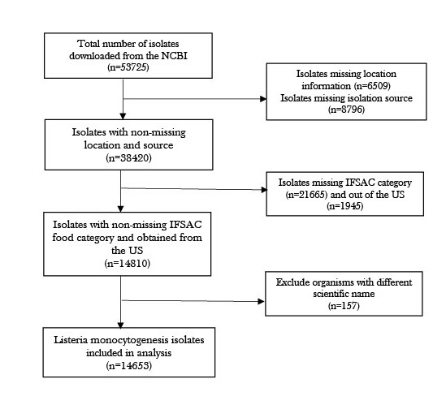

```{r include=FALSE}
knitr::opts_chunk$set(
echo = FALSE,
cache = FALSE,
message = FALSE,
warning = FALSE,
fig.align = 'center',
fig.pos = 'H',
dpi = 350,
tidy.opts = list(width.cutoff = 80, tidy = TRUE)
)
```

```{r include=FALSE, message=FALSE, warning=TRUE}
source("data/analysis_script.R")
```

## Introduction

The burden of foodborne illnesses remains substantially high across the globe. Contaminated food has been implicated in 600 million foodborne disease incidences and 420, 000 deaths per year worldwide with children below five years accounting for one-third of the total fatalities [@who2015, @Lee2021]. In the United States, foodborne illnesses result in about 128, 000 hospitalizations and about 3000 fatalities [@tanui2022machine]. Known pathogens account for most of the reported cases with most illnesses being caused by noroviruses (58%), followed by non-typhoid salmonella (11%), Clostridium perfringens (10%), and *Campylobacter SPP.* (9%) whereas non-typhoid salmonella (35%), and norovirus (26%) account for the most hospitalizations [@Scallan2011]. *Salmonella enterica*, *E-coli*, and *Listeria monocytogenes* remain the three most common pathogens responsible for most foodborne disease outbreaks, defined as two or more cases of a similar illness resulting from the ingestion of a common food [@tanui2022machine; @gourama2020foodborne].

*Listeria monocytogenes* remains one of the most severe causes of foodborne-related disease burden despite its characterization with low morbidity, particularly, due to the severity of its clinical manifestations [@chlebicz2018campylobacteriosis, @filipello2020attribution]. With the immuno-compromised, pregnant women, the elderly, and infants characterized as being at high risk for listeriosis, it is ranked as the third top cause of foodborne illness-associated deaths in the US [@lomonaco2015evolution]. The US Centers for Disease Control and Prevention (CDC) notes that about 1600 cases of listeriosis are recorded annually with about 260 mortalities [@cdc2022]. Outbreak investigations have shown links between these pathogens and specific food sources, a crucial phenomenon in identifying potential areas of food safety concern including points of contamination and the current performance of foodborne illness prevention strategies [@tanui2022machine].

In recent times, core genome multilocus sequence typing (cgMLST) has been employed to corroborate epidemiological findings, in addition to auditing the effect of public health interventions targeting the food chain on the food reservoirs [@tanui2022machine, @Munck2020]. This methodology enables differentiation of isolates and can be used to link them to their potential food sources in studies seeking to infer the food source of an outbreak given a pathogenic strain and ultimately result in a reduction in the incidence of foodborne illnesses [@tanui2022machine, @Munck2020]. Since the pathogens associated with foodborne illnesses are prone to change, understanding the role of these changes in their adaptation to food handling practices is imperative in the effective surveillance of the distribution, as well as, the occurrence of the pathogens. Moreover, the use of genomic data with machine learning methods has gained precedence due to the ability of these methods to learn patterns in high-dimensional data sets which are then exploited in predictive models [@Munck2020]. 

Even though machine learning models promise substantial gains in outbreak investigations, particularly while thinking about the use of cgMLST profiles in foodborne disease source attribution studies, there are a limited number of studies that have explored this avenue while thinking about the gains that these methods promise in allowing exploration of how foodborne pathogens adapt to or respond to food handling practices and how this information can be analyzed and ultimately reduce the incidence of listeriosis in humans. For instance, @tanui2022machine built a machine-learning model for food source attribution of Listeria monocytogenes using a boosted logit model whereas @Njage2019 employed next-generation sequencing using support vector machines with linear kernels to predict the risk of illnesses. 

Additionally, Lupolova et al. [@lupolova2017patchy], Munck et al. [@Munck2020], Tanui et al. [@tanui2022machine], and Karanth et al. [@karanth2022exploring] employed these methodologies in studying *Salmonella enterica*. Varied statistical methods have been employed in analyzing foodborne disease outbreak dynamics. For listeria outbreaks, advanced statistical analysis methods have also come into play including studies by Liu et al. [@liu2021machine] and Vangay et al., [@vangay2014classification] which used machine learning methods to provide advice on listeria outbreaks. On the other hand, Sun et al. [@sun2019quantitative] used Markov chain Monte Carlo (MCMC) to simulate the risk of a Listeria outbreak whereas Pasonen et al. [@pasonen2019listeria] employed a repeated exposures model to assess the risk of a Listeria outbreak in Finnish fish products. Mughini-Gras et al. [@mughini2022statistical] conducted a meta-analysis of sporadic infection sources of some pathogens including Listeria based on the Bayesian framework whereas Lassen et al., [@lassen2016two] used whole genome sequencing to analyze the risk of listeria outbreaks.
 
Given the serious threat of foodborne diseases and the high burden posed by listeriosis on human health, this research project seeks to expand the literature on foodborne disease source attribution for human listeriosis using Bayesian and ensemble-based machine learning methods and core genome multilocus sequencing typing data and other selected information about the sampled *Listeria monocytogenes* isolates in the US. In particular, the study seeks to evaluate common food categories and their link to foodborne illnesses using pathogenic isolates. The study seeks to explore the question: Given a human *Listeriosis monocytogene* isolate how likely is it to be from a particular isolate? This study is informed by the need to leverage emerging technologies to identify strategies to enhance food safety, and the food production process and ultimately reduce the burden of foodborne illnesses. The prevention of the transmission of foodborne illnesses promises substantial improvements in public health. Modeling periodic human cases of diseases attributable to food sources as well as animal reservoirs informs the public health decision making process [@pires2014source, @Munck2020].  

## Data overview

### Data source

This project uses secondary data downloaded on the 18th October, 2022 from the National Center for Biotechnology Information (NCBI) Pathogen Detection database [@ncbi2016] which assimilates bacterial and fungal pathogen genomic sequences from sources including food, environment, and patient samples. The data are contributed by researchers and public health agencies who sequence samples and submit them to NCBI where the sequences are analyzed and compared to identify relations between sequences and thus aid the investigation of outbreaks including real-time surveillance of pathogens such as those for foodborne illnesses. The isolates present in the database were collected by 390 different institutions and organizations. Even though the NCBI pathogen detection allows real-time identification of clusters of related genomic sequences to aid in outbreak detection, and track the spread of resistance genes, a potential limitation of this data source is that it does not identify outbreaks or outbreak memberships and analyses rely solely on publicly available data submitted to the database. 

### Data and variable descriptions

The data used in analyses in this project consisted of n=53, 725 *Listeria monocytogenes* pathogens with 50 variables related to the pathogenic strains submitted, including information about who collected the isolate, its taxonomic name, its isolation source, date of collection (day, month, year), country or state from which the strain originated, among other metadata. Given the vast amount of information available in the database, these analyses employed an inclusion criteria to select strains for further analysis. In particular, for consideration and inclusion into the analysis sample, the isolate had to have a non-missing location, had been collected in the US, had a non-missing isolation source, and IFSAC category. The analysis sample based on this inclusion criteria included a total of n = 14, 810 *Listeria monocytogenes* pathogens. Figure \@ref(fig:fig-one) summarizes the isolate inclusion criteria for analysis in this project.

```{r fig-one, echo=FALSE, dpi=300, out.width='50%', fig.align='center', fig.cap="The flow of the data cleaning process based on the specified isolate inclusion criteria."}

```

### Data preprocessing

There were 42,794 unique strains collected across the US states represented in this data set, a reflection of the variation and heterogeneity of the data. Additionally, there were 1403 unique isolation sources which comprise of *17,344 clinical types and 30,356 environmental/other types*. There were 296 different AMR genotypes, and 39 different outbreaks. The data has 285 unique isolate sourcing categories as developed by IFSAC category scheme, 90 unique hosts, and 67 unique host diseases. To make meaningful comparisons in relation to our objective, we aggregate the IFASC category into 7 broad  categories and examine the collection date to create date variables to explore trends over time. Since the `Collection date` variable contains the date the sample were collected in the format the submitter supplied ranging from Month-Date-Year, Year-Month and Year only while the `Create date` is in the Year-Month-Date ISO format with time stamp the data was added into the Pathogen Detection Project, we first convert these into a standard form of Year-Month-Date. Then for `Collection date` variable with missing values, we choose to fill in these dates by using those from the `Create date`. Finally we create new `Year` and `Month` variables and extract the respective years and months from the`Collection date` variable to maintain consistency in terms of available year records. For the Location variable, we reduced this to only include 50 states in the United States and 1 District (Puerto Rico). Table \@ref(tab:table-one) summarizes selected variables from the data set.


### Potential data limitations

Even though the NCBI pathogen detection allows real-time identification of clusters of related genomic sequences to aid in outbreak detection, and track the spread of resistance genes, a potential limitation of this data source is that it does not identify outbreaks or outbreak memberships and analyses rely solely on publicly available data submitted to the database. Additionally, the database allows a lot of flexibility in the naming conventions which results in substantial heterogeneity that make it difficult to query and extract meaningful patterns for microbial risk assessments [@sanaa2019genomegraphr]. For instance, the “collected by” and “isolation source” are fields entered as free text which are very extreme in the options they present for analysis. Moreover, there are a lot of missing data on potentially useful fields, a scenario that makes it difficult to derive inferences that could inform food policies.


```{r table-one, warning=FALSE}
kable(var_desc, format = "latex", caption = "Variable descriptions", booktabs = TRUE)%>%
  kable_styling(full_width = FALSE, latex_options = "HOLD_position")%>%
  column_spec(1, bold = TRUE)%>%
  row_spec(0, bold = TRUE) %>%
  column_spec(2, width = "11cm")
```


### Missing Data

We shall start by assessing the missingness in our data set. Figure \@ref(fig:fig-two) shows us the overall missingness of our selected variables ordered from the least to the largest missing percentage. Key to note here is that there is over 86% missing observations in the variables Host Disease, Lat/Long, and Outbreak, with Outbreak having the most percentage (99.54%) of missing values. This amount of missingness will be a major limitation of our study as these variables may not be informative in our analysis and may limit the interpretation and generalizability of our study findings.


```{r fig-two, fig.align='center', fig.cap="Missing values in variables"}
figure_one
```


## Exploratory data analysis

### Overall trends grouped by Isoaltion type

We used descriptive statistics to first examine the proportion represented by our main variable of interest, the isolation source which originally had 1401 unique values. Upon further examination, we found that were due to punctuation, case sensitivity as well as many variations of the naming conventions of a general source. For example, 'cheese', 'white cheese', 'ham cheese', and 'double cheeseburger'. For simplicity and for comparisons purposes, we grouped the isolation sources into broader categories based on the patterns observed in this variable. Ultimately, the number of isolation sources was reduced to 38 broad categories including environmental, food, pork, chicken, beef,turkey, stool, water, other/unspecified. We found that environmental sources were highest at 54.34% followed by other/unspecified sources (9.65%). Water, dairy, and food sources represented 9.65%, 9.24% and 6.43% respectively while fish, beef, and pork represented 1.67%, 1.56%, and 1.47% respectively.

We then used line plots to show an initial exploration of the trends in number of *Listeria monocytogenes* over time. We filtered our data to work with a time frame from the year 2000 to 2022. The line plots in Figure \@ref(fig:fig-three) shows a non-linear trend over time. There was a moderate increase in sample collected from the year 2000 to 2008, which sharply increased until approximately the year 2018. From 2018 to 2020, there was variation in terms of steady decrease/increase that was later followed by another sharp decrease in the samples collected. However, we also observed a slight increase in the counts following the year 2020. Grouped by isolation types, we observed a higher count in the environmental/other types compared to the clinical type which remained relatively lower throught the entire periods of sample collection.

```{r fig-three, fig.align='center', fig.cap= "Line plots of listeria monocytogenes counts over time and grouped by Isoaltion type"}
grid.arrange(figure_two, figure_three, ncol=2)

```

# Trends grouped by Isolation sources.

As mentioned previously, we reduced by `Isolation source` variable to 38 broad categories. In Figure \@ref(fig:fig-four), we explore the trends over time in the counts of `Listeria monocytogenes` for the following sources: beef, chicken, dairy, pork, fish, food, potato, water. We observe that the most common isolate source in our data is dairy, water, followed by food and and pork. 

```{r fig-four, out.width='100%', fig.cap= "Line plots of top Isolation surces for listeria monocytogenes counts over time"}

grid.arrange(figure_four, figure_five, ncol=2)

```

# Distributions of Min Same and Min Difference variables.

Next we examined the distributions of Min Same and Min Difference variables. Min-diff is the minimum SNP distance to another isolate of a different isolation type (from an environmental isolate to a clinical isolate). Figure \@ref(fig:fig-five) shows that `Min Diff` approximately follows a bi-modal distribution. However, after log transformation of this variable, Figure \@ref(fig:fig-six) shows that it appears to approximately follow a normal distribution with left skewed tails. Therefore, transformation of this variable may be considered prior to using it in further analysis. On the other hand, `Min-same` was the minimum SNP distance to another isolate of the same isolation type (clinical to clinical or environmental to environmental). Additionally, Figure \@ref(fig:fig-five) shows that `Min Same` approximately follows an exponential distribution and log transformation of this variable as shown in Figure \@ref(fig:fig-six) does not suggest a deviation from the exponential distribution.

```{r fig-five, out.width='90%', fig.cap= "Distributions of Min Same and Min Difference variables"}
figure_six
```


```{r fig-six, out.width='90%', fig.cap= "Distributions of Log Transformed Min Same and Min Difference variables"}
figure_seven
```

\newpage

### Statistical modeling


## Discussion


## Conclusion


\newpage
## References

<div id="refs"></div>

